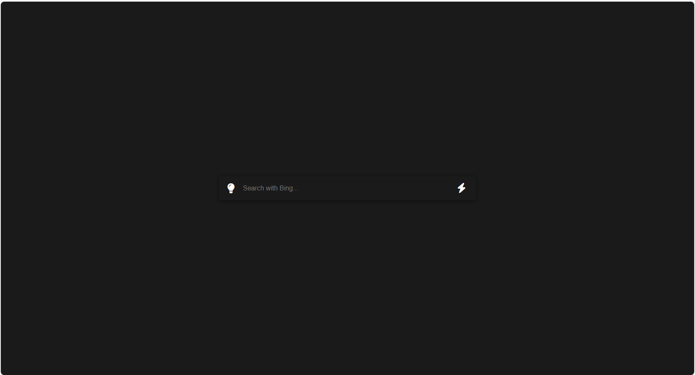

# LightBulb StartPage
> LightBulb StartPage is a personalized start page extension built just for you that will provide you with a simple yet elegant interface that will make you feel the warm glow every time you open your browser.  

> Demo images  



## Features
> Minimalist design: A black background with white text creates a peaceful and comfortable browsing environment while reducing eye strain.

> Quick Search: Simply enter a keyword and you'll easily access the Bing search engine to get the information you need.

> Lightning: The lightning bolt icon symbolizes a quick response, and whenever you click the search button, you won't get immediate results.
 
> Customization options: You can adjust the look of your start page to your personal preferences, including colors, fonts, and more, to make it truly your own space.

> Conclusion: LightBulb StartPage is not only a useful tool, but also a part of your daily browsing experience. Let this extension brighten up your web journey!

## Download, install, and use steps
### Step 1
Make sure you have downloaded the zip package of the project or git to download the code
### Step 2
Open your browser settings, and find Extensions, turn on developer mode.
### Step 3 
Click the Load Unzipped Extension button, find the downloaded "Bulb-Start-page" folder in File Explorer, select it, and click OK.
### Step 4
Click to enable the "Bulb-Start-page" extension, create a new tab, and select Keep Changes in the browser pop-up.
### Step 5
***Installation Complete***

> You can change the configuration with VScode or Sublime Text, etc., and we provide more detailed comments.
## Code
> popup.html
```html
<!DOCTYPE html>
<html lang="en">
<head>
    <meta charset="UTF-8">
    <meta name="viewport" content="width=device-width, initial-scale=1.0">
    <title>Bulb-Start-page</title>
    <!-- Link to Font Awesome CSS library for icons -->
    <link rel="stylesheet" href="https://cdnjs.cloudflare.com/ajax/libs/font-awesome/6.0.0-beta3/css/all.min.css">
    <!-- Link to external CSS file for styling -->
    <link rel="stylesheet" href="styles.css">
</head>
<body>
    <!-- Container for the search bar and lightning button -->
    <div class="search-container">
        <!-- Icon representing the bulb -->
        <i class="fas fa-lightbulb" id="lightbulb"></i>
        <!-- Search input field -->
        <input type="text" placeholder="Search with Bing..." id="searchInput">
        <!-- Lightning path container -->
        <div class="lightning-path">
            <!-- Search button with lightning icon -->
            <button id="searchButton" class="lightning-button"><i class="fas fa-bolt"></i></button>
        </div>
    </div>
    <!-- Ripple effect container (visual effect when clicking on elements) -->
    <div class="ripple-effect"></div>

    <!-- Link to external JavaScript file for functionality -->
    <script src="script.js"></script>
</body>
</html>  
```
> manifest.json
```json
{
  "manifest_version": 3, // The version of the manifest format used by this extension.
  "name": "Bulb-Start-page", // The name of the extension.
  "version": "1.0", // The version number of the extension.
  "description": "Lightbulb search interface with animation and integrated Bing search.", // A short description of what the extension does.
  "action": { // Configuration for the browser action (e.g., the button in the toolbar).
    "default_popup": "popup.html", // The HTML file that will be loaded when the browser action is clicked.
    "default_icon": { // The default icons for different sizes.
      "16": "icons/icon16.png", // The 16x16 pixel icon.
      "48": "icons/icon48.png", // The 48x48 pixel icon.
      "128": "icons/icon128.png" // The 128x128 pixel icon.
    }
  },
  "permissions": [ // Permissions required by the extension.
    "activeTab" // Permission to access the active tab.
  ],
  "chrome_url_overrides": { // URL overrides for Chrome's built-in pages.
    "newtab": "popup.html" // The page that will be shown when a new tab is opened.
  }
}
```
> styles.css
```css
/* Define global variables for colors and transitions */
:root {
    --bg-color: #1a1a1a; /* Background color of the body */
    --text-color: #fff; /* Text color */
    --highlight-color: yellow; /* Highlight color for animations */
    --transition-time: 0.3s; /* Transition duration for animations */
}

/* Style the body element */
body {
    font-family: Arial, sans-serif; /* Font family */
    display: flex; /* Display as a flexible container */
    flex-direction: column; /* Stack elements vertically */
    justify-content: center; /* Center content vertically */
    align-items: center; /* Center content horizontally */
    min-height: 100vh; /* Minimum height of the viewport */
    margin: 0; /* Remove default margins */
    background-color: var(--bg-color); /* Use the defined background color */
    color: var(--text-color); /* Use the defined text color */
    transition: background-color 0.8s ease; /* Smooth transition for background color changes */
}

/* Style the search container */
.search-container {
    display: flex; /* Display as a flexible container */
    align-items: center; /* Center items vertically */
    background-color: transparent; /* Transparent background */
    padding: 10px; /* Padding around the container */
    box-shadow: 0 2px 10px rgba(0,0,0,0.5); /* Box shadow effect */
    width: 100%; /* Full width */
    max-width: 600px; /* Maximum width of the container */
    border-radius: 4px; /* Rounded corners */
    transition: all var(--transition-time) ease; /* Smooth transition for all properties */
}

/* Style the lightbulb icon and lightning button */
#lightbulb, .lightning-button {
    margin: 0 10px; /* Margin around the elements */
    font-size: 24px; /* Font size */
    cursor: pointer; /* Change cursor to pointer on hover */
    transition: all var(--transition-time) ease; /* Smooth transition for all properties */
}

/* Style the lightning button */
.lightning-button {
    background: none; /* No background */
    border: none; /* No border */
    outline: none; /* No outline */
    color: var(--text-color); /* Use the defined text color */
}

/* Style the search input */
#searchInput {
    flex-grow: 1; /* Expand to fill available space */
    padding: 10px; /* Padding around the input */
    font-size: 16px; /* Font size */
    border: none; /* No border */
    outline: none; /* No outline */
    box-shadow: inset 0 2px 5px rgba(0,0,0,0.1); /* Slight inset shadow for depth */
    background-color: transparent; /* Transparent background */
    color: var(--text-color); /* Use the defined text color */
}

/* Keyframes for the light-up animation */
@keyframes light-up {
    0% { color: #ccc; } /* Initial color */
    50% { color: var(--highlight-color); } /* Midpoint color change */
    100% { color: var(--highlight-color); } /* Final color */
}

/* Apply the light-up animation to an element */
.light-up {
    animation: light-up 0.5s ease-in-out; /* Apply the light-up animation */
}

/* Style the ripple effect container */
.ripple-effect {
    position: absolute; /* Position absolutely within its parent */
    top: 0; /* Top position */
    left: 0; /* Left position */
    width: 100%; /* Full width */
    height: 100%; /* Full height */
    pointer-events: none; /* Ignore pointer events */
    z-index: -1; /* Place behind other elements */
}

/* Style the individual ripple */
.ripple {
    position: absolute; /* Position absolutely within its parent */
    border-radius: 50%; /* Circular shape */
    background: white; /* White background */
    opacity: 0.7; /* Opacity of the ripple */
    transform: scale(0); /* Start with no scale */
    animation: ripple-spread 0.8s ease-out forwards; /* Apply the ripple spread animation */
}

/* Keyframes for the ripple spread animation */
@keyframes ripple-spread {
    to {
        opacity: 0; /* Fade out at the end */
        transform: scale(1.5); /* Grow to 1.5 times its original size */
    }
}

/* Style the search results container */
#searchResults {
    margin-top: 20px; /* Margin at the top */
    width: 100%; /* Full width */
    max-width: 600px; /* Maximum width of the container */
}

/* Style each search result item */
.result-item {
    background-color: rgba(255, 255, 255, 0.1); /* Semi-transparent background */
    padding: 10px; /* Padding around the item */
    margin-bottom: 10px; /* Margin at the bottom */
    border-radius: 4px; /* Rounded corners */
    transition: background-color var(--transition-time) ease; /* Smooth transition for background color changes */
}

/* Style the result item on hover */
.result-item:hover {
    background-color: rgba(255, 255, 255, 0.2); /* Darker semi-transparent background on hover */
}

/* Media query for smaller screens */
@media (max-width: 650px) {
    .search-container {
        max-width: 90%; /* Adjust max-width for smaller screens */
    }

    #searchResults {
        max-width: 90%; /* Adjust max-width for smaller screens */
    }
}
```
> script.js
```js
// Get references to the DOM elements
const lightbulb = document.getElementById('lightbulb'); // The lightbulb element
const searchInput = document.getElementById('searchInput'); // The search input field
const searchButton = document.getElementById('searchButton'); // The search button
const body = document.body; // The body element

/**
 * Triggers the search animation and performs a search after the animation completes.
 * @param {Function} callback - A callback function to execute after the animation.
 */
function triggerSearchAnimation(callback) {
    lightbulb.classList.add('light-up'); // Add the light-up class to the lightbulb

    // Create a new ripple element
    const ripple = document.createElement('div');
    ripple.className = 'ripple'; // Set the class of the ripple element
    const rippleEffect = document.querySelector('.ripple-effect'); // Get the ripple effect container
    rippleEffect.appendChild(ripple); // Append the ripple to the ripple effect container

    // Position the ripple over the lightbulb
    const rect = lightbulb.getBoundingClientRect();
    ripple.style.left = `${rect.left + rect.width / 2}px`;
    ripple.style.top = `${rect.top + rect.height / 2}px`;

    // Change the background and text color of the body
    body.style.backgroundColor = '#ffffff';
    body.style.color = '#000000';

    // After 1 second, remove the ripple and reset the background and text color
    setTimeout(function() {
        rippleEffect.removeChild(ripple);
        body.style.backgroundColor = '';
        body.style.color = '';
        if (callback) callback();  // Execute the callback function after the animation
    }, 1000);
}

/**
 * Performs a search using Bing with the given query.
 * @param {string} query - The search query.
 */
function performSearch(query) {
    const bingSearchUrl = `https://www.bing.com/search?q=${encodeURIComponent(query)}`; // Construct the Bing search URL
    window.open(bingSearchUrl, '_blank'); // Open the URL in a new tab
}

// Add an event listener to the search button
searchButton.addEventListener('click', function() {
    triggerSearchAnimation(() => performSearch(searchInput.value)); // Trigger the search animation and perform the search
});

// Add an event listener to the search input for the Enter key press
searchInput.addEventListener('keypress', function(e) {
    if (e.key === 'Enter') {
        triggerSearchAnimation(() => performSearch(searchInput.value)); // Trigger the search animation and perform the search
    }
});
```

## Contact
If you find a bug or suggestion, please send an email to 'dolp666999@gmail.com'.
